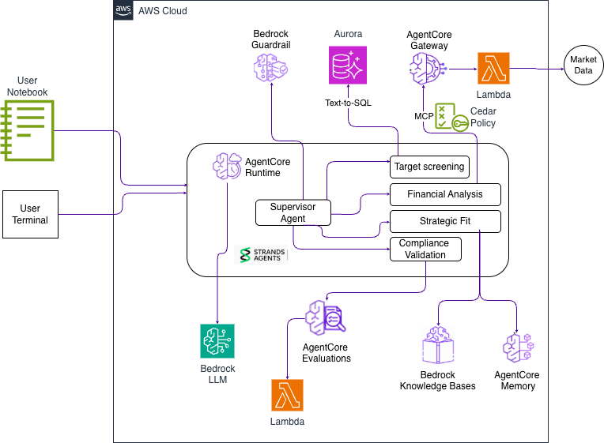

# M&A Due Diligence Multi-Agent Sample

A self-contained AWS sample that demonstrates a supervisor-plus-specialists
agent pattern on [Amazon Bedrock AgentCore](https://docs.aws.amazon.com/bedrock-agentcore/latest/devguide/)
using the [Strands Agents SDK](https://strandsagents.com/). The sample
models an end-to-end M&A due-diligence workflow in the transportation
and logistics industry, grounded entirely in synthetic data.

This sample accompanies a companion AWS Machine Learning blog post (coming soon). It is optimised for three things, in order:

1. **Reader experience** — one command to deploy, one command to tear
   down, a Jupyter notebook as the primary interactive surface.
2. **Faithfulness to the blog's architecture diagram** — the layers you
   see in Figure 1 map to actual resources in the stack.
3. **Production-adjacency** — least-privilege IAM, Aurora in private
   subnets, CloudWatch + X-Ray on every call, but not over-engineered
   for a sample.

> ⚠️ Everything in the sample is synthetic. There are no real companies,
> no real financial data, and no real PII. Every generated document
> carries a `SYNTHETIC DATA - NOT REAL` header.

---

## Table of Contents

- [Overview](#overview)
- [Architecture](#architecture)
- [Security Architecture](#security-architecture)
- [Prerequisites](#prerequisites)
- [Quick start](#quick-start)
- [Running the walkthrough](#running-the-walkthrough)
- [Example prompts](#example-prompts)
- [What's implemented vs. extension](#whats-implemented-vs-extension)
- [Cost](#cost)
- [IAM summary](#iam-summary)
- [Cleanup](#cleanup)
- [Troubleshooting](#troubleshooting)
- [Documentation and references](#documentation-and-references)
- [Contributing](#contributing)
- [License](#license)

---

## Overview

The sample deploys one supervisor agent and four specialist agents on
Amazon Bedrock AgentCore Runtime. The supervisor is a Strands `Agent`
that uses the agents-as-tools pattern to route each prompt to one or
more specialists:

| Agent | Role | Primary tool(s) |
|---|---|---|
| Target Screening | Translate natural language into SQL and surface candidates from a target-company table. | Text-to-SQL over Amazon Aurora (PostgreSQL) + Amazon Bedrock Knowledge Bases |
| Financial Analysis | Run a DCF and pull comparable-company multiples with inline citations on every numeric input. | Amazon Bedrock Knowledge Bases + AgentCore Gateway-backed market-data tool |
| Strategic Fit | Compare the current target against prior deals stored in long-term memory. | Amazon Bedrock Knowledge Bases + AgentCore Memory (`prior_deals` namespace) |
| Compliance Validation | Audit a response against the M&A governance checklist and flag any uncited claim. | Amazon Bedrock Knowledge Bases + custom citation-check evaluator AWS Lambda |

Every response is routed through Amazon Bedrock Guardrails, every factual
claim is required to cite a source, and every invocation produces a
CloudWatch log stream plus an X-Ray trace that captures the
supervisor → specialist → tool call hierarchy.

---

## Architecture

See **Figure 1** in the companion blog post for the annotated diagram.
The canonical layer mapping is in the table at
[What's Implemented vs. Extension](#whats-implemented-vs-extension).



Infrastructure-as-Code is AWS CDK v2 (Python). Stacks deploy in this
dependency order:

`NetworkStack → DataStack → EvaluatorStack → GatewayStack → AgentStack`

All AgentCore resources (Runtime, Memory, Gateway) are provisioned
using the stable **L2 constructs** in `aws-cdk-lib` (`aws_bedrockagentcore`
module, requires `aws-cdk-lib>=2.258.1`). The previous Custom Resource
fallback path has been removed. IAM is simplified using L2 grant helpers
(`memory.grant_read()`, `memory.grant_write()`, `gateway.grant_invoke()`).

### Streaming and timeouts

The supervisor handler is **async** and uses `agent.stream_async(prompt)`
to stream response chunks to the client in real-time. This prevents the
60-second service timeout on complex multi-specialist chains that can
take 60–90 seconds. After streaming completes, a final metadata event
is yielded containing structured citations and the X-Ray trace ID.

The boto3 AgentCore client is configured with `read_timeout=300` seconds
(up from the default 60 s) to accommodate multi-specialist invocations.

The agent container image (ARM64 Linux) is built in AWS CodeBuild, so
Docker is **not** required on the reader's machine. See the *Container
Build Pipeline* section of `.kiro/specs/ma-due-diligence-agentcore/design.md`
for the full flow.

---

## Security Architecture

M&A due-diligence data is highly confidential — target-company
financials, deal terms, and integration plans — so security is layered
across every tier of the sample rather than bolted on as an
afterthought:

- **Identity and access (IAM)** — every AgentCore-callable AWS
  permission is scoped to a specific resource ARN (model, guardrail,
  knowledge base, table, memory, gateway). The only `Resource: "*"`
  statements are the two AWS requires (ECR token issuance,
  foundation-model ARN wildcards); both are documented inline in
  `infra/stacks/agent_stack.py`.
- **Fine-grained authorization (Cedar)** — the AgentCore Gateway's
  market-data tool is protected by a Cedar policy engine with a
  default-deny model (`infra/stacks/gateway_stack.py` +
  `infra/policies/market_data_gateway.cedar`). A `permit` statement
  allows the tool to run only when the requested industry code
  matches transportation, logistics, or trucking — every other
  request is denied before the tool executes. This adds
  attribute-based, input-aware authorization on top of IAM's coarser
  action/resource model.
- **Network isolation** — Amazon Aurora runs in private isolated
  subnets with no route to the internet; VPC interface endpoints keep
  Secrets Manager and RDS Data API traffic off the public internet
  entirely (`infra/stacks/network_stack.py`).
- **Encryption at rest** — every data store (S3, DynamoDB, Aurora) is
  encrypted with AWS-managed KMS keys; the documents bucket blocks all
  public access and enforces TLS on every request.
- **Guardrails** — Amazon Bedrock Guardrails filter harmful content
  and block personalized financial-advice requests on every
  supervisor invocation.
- **Secrets management** — Aurora credentials are auto-generated into
  Secrets Manager (nothing hardcoded); IAM database authentication
  offers a passwordless path for the agent runtime.

See the [IAM Summary](#iam-summary) section below for the full role
and permission breakdown.

---

## Prerequisites

| Tool | Version | Windows | macOS | Linux |
|---|---|---|---|---|
| AWS account | n/a | Any account with permission to deploy the stacks below | same | same |
| AWS CLI | v2.15+ | MSI installer | `brew install awscli` | distribution package / pip |
| Python | 3.11+ | [python.org](https://www.python.org/downloads/) installer | `brew install python@3.11` | distribution package / pyenv |
| Node.js | 20+ | [nodejs.org](https://nodejs.org/) installer | `brew install node` | distribution package / nvm |
| AWS CDK | v2 | `npm install -g aws-cdk` | `npm install -g aws-cdk` | `npm install -g aws-cdk` |
| Shell | any recent | PowerShell 5.1+ (built-in) | `bash` (built-in) | `bash` (built-in) |

You do **not** need Docker, WSL, buildx, or Git Bash. The agent image
is built in AWS CodeBuild. The PowerShell scripts are native.

Supported AWS regions (Amazon Bedrock AgentCore GA):

- `us-east-1`
- `us-west-2`
- `ap-southeast-2`
- `eu-central-1`

`scripts/check_region.sh` / `check_region.ps1` enforces this list at
deploy time. See the authoritative list in the
[AgentCore regions documentation](https://docs.aws.amazon.com/bedrock-agentcore/latest/userguide/regions.html).

---

## Quick Start

**macOS / Linux:**

1. Clone the repository:
   ```bash
   git clone https://github.com/aws-samples/sample-ma-due-diligence-agentcore.git
   ```
2. Change into the project directory:
   ```bash
   cd sample-ma-due-diligence-agentcore
   ```
3. Run the deploy script:
   ```bash
   ./deploy.sh
   ```

**Windows:**

1. Clone the repository:
   ```powershell
   git clone https://github.com/aws-samples/sample-ma-due-diligence-agentcore.git
   ```
2. Change into the project directory:
   ```powershell
   cd sample-ma-due-diligence-agentcore
   ```
3. Run the deploy script:
   ```powershell
   .\deploy.ps1
   ```

The deploy script will:

1. Verify the AWS region is GA for AgentCore.
2. Create a local `.venv`, install pinned dependencies from
   `requirements.txt`, and install this project itself in editable
   mode (`pip install -e .`). That last step registers the `mna`
   console-script entry point you'll use starting in
   [Running the Walkthrough](#running-the-walkthrough) — no separate
   install needed.
3. Run `cdk bootstrap` (idempotent).
4. Run `cdk deploy --all --require-approval never` in dependency order.
5. Seed synthetic data via `python data/generate.py --seed-all`.
6. Run `tests/smoke_test.py` against the deployed stack as a post-deploy
   verification step.
7. Print next-steps instructions.

First-time deploys take about 20-25 minutes (Amazon Aurora Serverless v2 is
the long pole). Re-deploys take a few minutes.

Skip flags for re-runs:

| Flag (bash / PowerShell) | Purpose |
|---|---|
| `--skip-preflight` / `-SkipPreflight` | Skip the region check. |
| `--skip-venv` / `-SkipVenv` | Use active Python instead of creating `.venv`. |
| `--skip-seed` / `-SkipSeed` | Skip `data/generate.py --seed-all`. |
| `--skip-smoke` / `-SkipSmoke` | Skip the post-deploy smoke test. |

---

## Running the Walkthrough

Invoke agents from the CLI. Each command targets a single specialist
and exercises a distinct capability of the architecture. `--session-id`
can be any string between 33 and 256 characters — Amazon Bedrock
AgentCore's length constraint on `runtimeSessionId` — so a UUID or a
descriptive slug padded to length both work; omit the flag and the CLI
generates a UUID for you.

```bash
mna list-agents

# Supervisor orchestration — the LLM routes to one or more specialists
mna invoke supervisor "Screen the mid-market logistics targets with revenue 100M-500M, then run a DCF on the top hit." --session-id walkthrough-session-00000000-0001

# Target Screening — text-to-SQL on Aurora + KB narrative enrichment
mna invoke target_screening "Screen the target pipeline for transportation companies with revenue between 100M and 500M USD, EBITDA margin above 12%, and fleet size above 200. Surface the top three and tell me what the CIM says about the leader's growth trajectory." --session-id walkthrough-session-00000000-0001

# Financial Analysis — KB retrieval + AgentCore Gateway tool (market data)
mna invoke financial_analysis "Run a DCF on Example Corp using the CIM in the knowledge base. Flag any management projection that diverges from historical performance by more than 20%, and pull comparable multiples for transportation-logistics mid-market." --session-id walkthrough-session-00000000-0001

# Strategic Fit — AgentCore Memory long-term retrieval (prior_deals namespace)
mna invoke strategic_fit "Compare Example Corp' integration profile against the three most recent completed acquisitions. Identify the top three integration risks and cite the source memos." --session-id walkthrough-session-00000000-0001
```

Copy the full prompt text from [`prompts.md`](./prompts.md) for the
canonical versions of each prompt.

Every `mna invoke` prints `trace_id=...` in its footer. Feed that
value into `mna trace` to inspect the X-Ray trace for that specific
invocation:

```bash
mna invoke financial_analysis "Run a DCF on Example Corp."
# footer: ... | session_id=demo | trace_id=1-abcd1234-ef567890
mna trace 1-abcd1234-ef567890
```

The `mna evaluate` subcommand runs the citation-check evaluator
against a response + citations pair. This is how you audit any
specialist's output for unsupported factual claims.

**Step 1 — capture a specialist response in JSON mode:**

```bash
mna --json invoke financial_analysis "Run a DCF on Example Corp using the CIM." > run.json
```

Note: `--json` goes before the subcommand. Log lines go to stderr
and won't pollute the JSON file.

**Step 2 — extract the response text:**

```bash
python -c "import json,pathlib;d=json.loads(pathlib.Path('run.json').read_text(encoding='utf-8'));pathlib.Path('response.txt').write_text(d['text'],encoding='utf-8')"
```

**Step 3 — extract the citations:**

```bash
python -c "import json,pathlib;d=json.loads(pathlib.Path('run.json').read_text(encoding='utf-8'));pathlib.Path('citations.json').write_text(json.dumps(d['citations']),encoding='utf-8')"
```

**Step 3 — run the evaluator:**

```bash
mna evaluate --response-file response.txt --citations-file citations.json
```

The evaluator prints a structured result:

```
Citation check: PASS (or FAIL)
  total_claims=N
  supported=M
  unsupported=K
  Unsupported claims:
    - <claim text>
    - ...
```

The exit code is 0 on PASS, 1 on FAIL — composable in CI pipelines.

For a guided, cell-by-cell tour of the same flow, open the notebook:

```bash
jupyter lab notebooks/walkthrough.ipynb
# or: jupyter notebook notebooks/walkthrough.ipynb
```

The notebook cells, in order:

1. Environment validation (region, credentials, SSM parameters populated).
2. Data overview (KB document list + Aurora row counts).
3-6. One cell per specialist agent with the prompt, the invocation via
   `mna.client.invoke_agent`, and a rendered response plus citations.
7. Trace inspection for the most recent invocation.

Both the notebook and the CLI delegate to the shared `mna.client`
module, so there is no invocation logic duplicated across surfaces.

---

## Example Prompts

Four ready-to-copy prompts, one per specialist, are documented in
[`prompts.md`](./prompts.md). Each prompt includes the expected agent,
the expected citation sources, and the architectural capability it
demonstrates.

Summary:

| Agent | What the prompt demonstrates |
|---|---|
| Target Screening | Text-to-SQL on Aurora + KB narrative enrichment |
| Financial Analysis | KB retrieval + Gateway-backed tool + inline numeric citations |
| Strategic Fit | AgentCore Memory long-term retrieval + namespace isolation |
| Compliance Validation | Citation-check evaluator + end-to-end audit loop |

---

## What's Implemented vs. Extension

The table below mirrors the architecture layers in the blog's Figure 1.
"Implemented" means shipped in this sample; "Extension" means out of
scope for v1, with a pointer to a more complete sample when one
exists.

| Layer | Implemented in v1 | Extension |
|---|---|---|
| Presentation | Jupyter notebook + argparse CLI | React frontend, Amazon Cognito, Amazon CloudFront (see the [FAST template](https://github.com/awslabs/fast)) |
| Agent Orchestration — Runtime | AgentCore Runtime hosting Strands supervisor + 4 specialists | Multi-tenant runtime isolation |
| Agent Orchestration — Strands SDK | Python Strands `Agent` per role; supervisor uses `use_agent` pattern | Non-Strands agent frameworks |
| Agent Orchestration — Memory | AgentCore Memory (session + `prior_deals` namespace) | Cross-account Memory sharing |
| Agent Orchestration — Guardrails | Amazon Bedrock Guardrail on the supervisor | Output-only guardrails, PII redaction |
| Agent Orchestration — Identity | — | AgentCore Identity with JWT validation flows |
| Agent Orchestration — Gateway | One Lambda-backed MCP tool | Additional Gateway targets (HTTP APIs, MCP servers, API Gateway) |
| Agent Orchestration — Observability | CloudWatch Logs + X-Ray on every invocation | Dashboards, alarms, anomaly detection |
| Data — Amazon Aurora PostgreSQL | Serverless v2 (0.5-2 ACU), target-companies schema, text-to-SQL | Read replicas, multi-region |
| Data — Amazon DynamoDB | `mna-sessions` per-turn audit log (prompt, response, citations, trace id, evaluator result) with 7-day TTL | Global tables |
| Data — Amazon Bedrock Knowledge Bases | Synthetic CIMs, financials, press packs, governance checklist | Cross-account KBs, document-level ACLs |
| Data — S3 | Documents bucket (block public, SSE-S3, versioned) | SSE-KMS with customer managed key, Object Lock |
| Gateway Targets — Lambda | One market-data mock Lambda | Additional tools (HTTP APIs, third-party APIs, SaaS connectors) |
| Evaluation — Custom evaluator | Citation-check Lambda + local mirror | AgentCore Evaluations, LLM-as-judge, continuous monitoring |
| Security — IAM | Least-privilege roles, scoped resource ARNs | — |
| Security — Authorization | Cedar policy engine on the AgentCore Gateway (default-deny, industry-scoped market-data tool access) | Cedar policies on additional tools/gateways |
| Security — Encryption | AWS-managed KMS (SSE-S3, DynamoDB, Aurora) | Customer-managed KMS keys |
| Security — Network | Aurora in private isolated subnets; VPC endpoints for Secrets Manager, RDS Data API, S3 | PrivateLink everywhere, AWS Config rules, CloudTrail data events |

---

## Cost

Target: **under $5 USD** for a full deploy-run-cleanup cycle (about 1
hour of wall time).

| Service | Expected cost | Notes |
|---|---|---|
| Aurora Serverless v2 | ~$0.12 | 1 hour at 0.5 ACU minimum (or 0 ACU if configured to scale to zero) |
| AgentCore Runtime | ~$0.30 | ~5 minutes of active compute across the four prompts |
| Bedrock (Claude Sonnet 4.5 + Haiku + Titan Embed) | ~$1.00 | 4 prompts + embedding ingestion |
| Amazon Bedrock Knowledge Bases (vector ops) | ~$0.20 | Serverless pricing |
| DynamoDB | <$0.01 | On-demand, minimal writes |
| Lambda (evaluator + market-data + build waiter) | <$0.01 | Free tier |
| CodeBuild (ARM64 Linux) | <$0.05 | ~5 min per deploy; free tier covers first 100 min/month |
| ECR storage | <$0.01 | One ~500 MB image, minimal duration |
| S3 | <$0.01 | A few MB of synthetic documents |
| CloudWatch Logs | <$0.10 | 7-day retention cap |
| NAT Gateway | ~$0.05 | 1 hour of idle NAT; VPC endpoints eliminate most egress |
| **Total (estimate)** | **~$1.85** | Well under the $5 target |

Cost controls baked into the sample:

- Aurora scales to minimum ACU when idle (0.5 ACU).
- CloudWatch log retention is capped at 7 days.
- DynamoDB TTL expires session items after 7 days.
- `cleanup.sh` / `cleanup.ps1` destroys every billable resource. **Run
  it as soon as you are done exploring.**

---

## IAM Summary

| Role | Principal | Key permissions |
|---|---|---|
| `AgentRuntimeRole` | AgentCore Runtime | `bedrock:InvokeModel`, `bedrock-agent-runtime:Retrieve`, RDS Data API (read-only on `mna.target_companies`), DynamoDB `mna-sessions` RW, AgentCore Memory RW, Gateway invoke, citation-check Lambda invoke |
| `EvaluatorLambdaRole` | Lambda service | CloudWatch Logs only |
| `MarketDataLambdaRole` | Lambda service | CloudWatch Logs only |
| `KnowledgeBaseRole` | Amazon Bedrock Knowledge Bases service | S3 read (documents bucket), Aurora pgvector write |
| `BuildTriggerRole` / `BuildWaiterRole` | Lambda service | CodeBuild start/describe, CloudWatch Logs |
| Deployment role | Reader's own AWS credentials | CloudFormation + the underlying CDK bootstrap |

Every agent-callable AWS permission is scoped to resource ARNs. The
only `*` resource is on `bedrock:InvokeModel`, which is required to
invoke any model ID the supervisor/specialists are configured to use.

---

## Cleanup

> ⚠️ **Warning:** Cleanup permanently deletes all data in Amazon S3,
> Amazon DynamoDB, Amazon Aurora, and Amazon Bedrock AgentCore Memory.
> Export anything you need to retain before proceeding.

```bash
./cleanup.sh
```

```powershell
.\cleanup.ps1
```

The cleanup script runs `cdk destroy --all --force` (CDK handles the
reverse destruction order automatically) and then
`scripts/verify_cleanup.sh` / `.ps1` to scan for orphaned resources
that sometimes survive a failed mid-deploy:

- S3 buckets matching `mna-*`.
- ECR repositories matching `mna-*`.
- Amazon Bedrock Knowledge Bases with `mna` in the name.
- AgentCore Runtimes, Memories, and Gateways.
- CloudFormation stacks starting with `Mna`.

The verification script prints copy-paste commands for each sweep so
you can confirm a zero-cost end state. Expected output is empty for
every sweep.

---

## Troubleshooting

| Symptom | Cause | Fix |
|---|---|---|
| `check_region.*` exits non-zero: "region not supported" | Current AWS region is not GA for AgentCore. | Set `AWS_REGION` or `aws configure set region` to one of the supported regions listed above. |
| `cdk bootstrap` fails with "AccessDenied on s3:PutBucketPublicAccessBlock" | Your caller identity lacks bootstrap permissions. | Use credentials with `AdministratorAccess` for the first bootstrap; downgrade afterwards. |
| `cdk deploy` fails on AgentStack with "CodeBuild build failed" | The agent image could not be built. Usually a Docker Hub rate-limit or a dependency-resolution error. | Re-run `deploy.sh` — the build trigger re-attempts. If it fails twice, open the CloudWatch log group `/aws/codebuild/mna-agent-builder`. |
| `cdk deploy` on AgentStack hangs for >15 minutes after "Build started" | Build waiter polling timed out. | Re-run `deploy.sh`. A cold CodeBuild start plus a cold Aurora provision can push the first deploy close to the waiter cap. |
| `cdk deploy` fails on DataStack with "Aurora cluster creation timed out" | Aurora Serverless v2 provisioning can exceed 20 minutes in heavily-used regions. | Re-run `deploy.sh` — the stack resumes from the last successful resource. |
| `generate.py --seed-all` fails with "ingestion job failed" | A KB document could not be parsed or embedded. | `generate.py` prints the failing document IDs; remove them from the generator seed list and re-run. |
| Agent invocation returns "no supporting documents found" | The KB ingestion job hadn't completed when the prompt ran. | Wait 2-3 minutes after `generate.py` finishes, then re-run the prompt. The ingestion job's status is in Amazon Bedrock Knowledge Bases console. |
| Notebook trace cell returns "(not yet indexed)" | X-Ray trace indexing lag (a few seconds after the invocation). | Re-run the cell. The `mna.client.get_last_trace` helper already retries with backoff. |
| `cleanup.sh` succeeds but S3 bucket still exists | The S3 bucket had versioned objects that the default cleanup did not delete. | Run `aws s3 rb s3://<bucket-name> --force`, or empty the bucket first via the console. |
| Windows PowerShell: "running scripts is disabled on this system" | PowerShell execution policy is Restricted. | Run `Set-ExecutionPolicy -Scope CurrentUser -ExecutionPolicy RemoteSigned` once, then re-run `.\deploy.ps1`. |
| Docker errors appear during deploy | Deploy is trying to build the image locally instead of in CodeBuild. | This should never happen; file an issue with the CDK synth output. The build pipeline in `infra/constructs/build_pipeline.py` owns the CodeBuild path. |

For anything not listed here, run the deploy with `set -x` (bash) or
`$DebugPreference = "Continue"` (PowerShell) and open an issue with
the full output.

---

## Documentation and References

- Companion AWS Machine Learning blog post — coming soon.
- [Amazon Bedrock AgentCore documentation](https://docs.aws.amazon.com/bedrock-agentcore/latest/devguide/)
- [Strands Agents SDK documentation](https://strandsagents.com/)
- [Amazon Bedrock Knowledge Bases documentation](https://docs.aws.amazon.com/bedrock/latest/userguide/knowledge-base.html)
- [Amazon Bedrock Guardrails documentation](https://docs.aws.amazon.com/bedrock/latest/userguide/guardrails.html)
- [AWS Samples — other AgentCore and Strands examples](https://github.com/aws-samples)

---

## Contributing

Contributions are welcome. See [`CONTRIBUTING.md`](./CONTRIBUTING.md)
for the full guide, including:

- How to add a new specialist agent (file layout, Strands pattern,
  system prompt, registration in the supervisor).
- How to add a new tool (file layout, IAM permission updates,
  testing).
- Custom Resource review checklist (design §*Custom Resource Safety
  Requirements*).
- Code style (ruff rules), PR checklist, CLA reference.

---

## License

This sample is licensed under the **MIT No Attribution License
(MIT-0)**. See [`LICENSE`](./LICENSE) for details. You may use, copy,
modify, merge, publish, distribute, sublicense, and/or sell copies of
the software with no attribution required.
